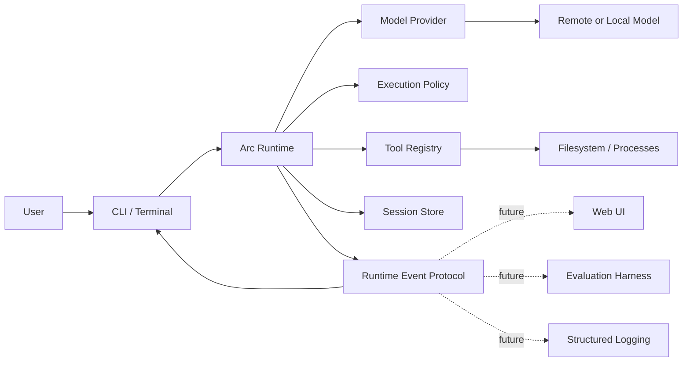
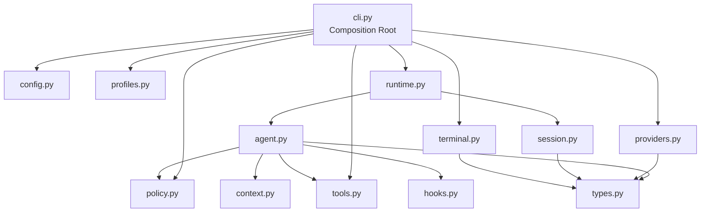
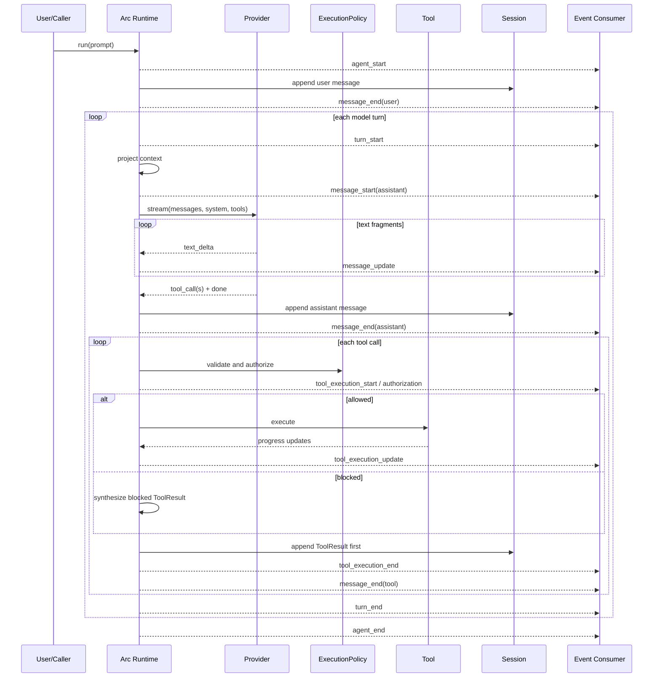

# Arc 架构设计报告

> 文档状态：当前架构基线
> 对应版本：Arc CLI 0.1.1
> 更新日期：2026-09-12
> 目标读者：Arc 维护者、Profile/Tool/Provider 开发者、终端与 Runtime 集成方

## 1. 摘要

Arc 是一个终端原生的 Agent Runtime。它当前以软件开发 Agent 的形式交付，但架构目标并不是再造
一个只能写代码的 CLI，而是建立一套可以被不同 Agent 形态复用的运行时基础：模型负责提出下一步
行动，Runtime 负责维护状态、校验协议、授权副作用、执行工具、持久化历史，并以稳定事件流向界面
报告发生了什么。

Arc 的核心表达式是：

```text
Arc Runtime + Profile + Tools + Policy
```

其中：

- **Runtime** 管理模型—工具循环、消息状态、取消、恢复和事件生命周期；
- **Profile** 描述某类 Agent 的行为方式和默认工具集合；
- **Tools** 提供结构化能力，但不自行决定是否获得执行权限；
- **Policy** 在工具实现运行之前，根据 effect 对模型提案进行授权；
- **Provider** 只负责模型协议适配，不执行工具；
- **Session** 保存可恢复、可分支的事实历史；
- **Renderer** 消费 Runtime Event，将同一运行时投影为终端文本或 JSONL。

这套设计希望长期守住四个边界：

1. 模型输出不是权限；
2. Workspace 内容不是系统规则；
3. 持久化历史不等于模型上下文；
4. UI 消费失败不应抹掉已经发生的副作用事实。

## 2. 背景与问题定义

一个实用 Agent 不只是“循环调用大模型”。当模型可以读写文件、启动进程并连接外部系统后，产品的
主要复杂度会转移到模型之外：

- 谁决定一个工具调用能不能执行；
- 哪些凭据能够进入工具子进程；
- 中途中断后，怎样避免重复执行已有副作用；
- 工作区中的说明文件是否可以改变安全规则；
- 多轮历史如何持久化，又如何控制实际发送给模型的上下文；
- CLI、Web UI、评测器和日志系统如何观察同一套 Runtime；
- 流式输出与交互输入如何共存，而不破坏终端内容。

Arc 将这些问题视为 Runtime 的一等职责，而不是通过更长的 system prompt 或更多终端日志来掩盖。

## 3. 架构目标与非目标

### 3.1 架构目标

Arc 当前架构追求以下目标：

1. **明确授权链路**：形成 `Model proposes → Arc authorizes → Tool executes`；
2. **可恢复执行**：取消、崩溃或重新打开 Session 后，保持消息与工具结果的结构完整；
3. **职责解耦**：Agent loop 不依赖具体 Provider、终端界面或会话文件格式；
4. **低信任 Workspace**：项目说明可以指导工作，但不能提升权限或覆盖 Runtime Policy；
5. **Secret 最小暴露**：Provider credentials 永不进入模型可调用的子进程环境；
6. **可组合输出**：终端、JSONL、未来 Web UI 和 evaluation harness 消费同一事件协议；
7. **终端原生体验**：不使用全屏 TUI，保留 shell 的滚动、选择、复制和管道能力；
8. **扩展而不侵入 Core**：增加 Profile、Tool 或 Provider 时，尽量不修改 Agent loop。

### 3.2 当前非目标

以下能力不属于当前实现的承诺：

- Arc 不是容器、虚拟机或操作系统级沙箱；
- Bash 命令分类不是完整的 shell 静态分析；
- 当前 CLI 尚未提供逐次调用的交互式 approval 对话框；
- 当前仅内置 OpenAI Chat Completions 兼容 Provider；
- 当前 Markdown Renderer 不是完整 CommonMark 实现；
- 当前没有 MCP、Plugin、Browser、Phone 等生态能力；
- 当前 Context 模块还不是完整的 token-aware ContextBuilder。

这些非目标不是永久拒绝，而是为了先稳定边界，再扩展功能面。

## 4. 总体架构

### 4.1 系统上下文



用户通过 CLI 发起任务。Runtime 组装模型上下文并调用 Provider。模型返回文本或结构化 ToolCall，
Runtime 对 ToolCall 做验证和授权，只有被允许的调用才会进入工具实现。每一步都转化为 Event，同时
消息事实被追加到 Session Store。终端只是 Event 的一个消费者，不拥有 Agent 状态。

### 4.2 代码层次与依赖方向



依赖方向遵循以下规则：

- `cli.py` 是 Composition Root，负责选择和连接组件；
- `agent.py` 不导入终端、HTTP 客户端或 JSONL 存储细节；
- `providers.py` 只将外部协议转换为统一 ProviderEvent；
- `terminal.py` 只消费 Event 和查询 Session 的展示信息，不参与模型决策；
- `session.py` 保存 Message，不参与授权；
- 跨层共享结构集中在 `types.py`，避免组件彼此引用实现类型。

## 5. 核心运行模型

### 5.1 Arc 的状态

`Arc` 实例持有一次会话运行所需的内存状态：

- `provider`：模型协议接口；
- `tools`：当前 Profile/CLI 选择后的工具注册表；
- `policy`：工具执行授权策略；
- `messages`：当前 Session 分支重建出的事实历史；
- `context_prefix`：不持久化的 User/Workspace 上下文；
- `tool_env`：初始化时创建的、已经清洗的子进程环境快照；
- `steering`：下一次模型调用前注入的指令队列；
- `follow_ups`：当前工具循环自然结束后继续处理的任务队列；
- `is_running`：防止同一个 Arc 实例并发执行两个主循环。

Arc 不把终端是否存在作为运行条件，因此同一核心既可以被交互 CLI 使用，也可以被单次执行、JSONL
消费者或未来的其他前端使用。

### 5.2 单次任务生命周期

实际生命周期如下：



这里最重要的顺序约束是：**工具完成后，Runtime 先把 ToolResult 写入内存消息状态，再向消费者发出
完成事件。** 如果 UI 在收到事件时崩溃，`ArcSession` 的退出清理仍能保存这个结果，不会把已经发生
的副作用误认为没有发生。

### 5.3 Provider 输出完成后才执行工具

Provider 的流式响应可能将工具名称、ID 和 JSON 参数拆成多个 fragment。Arc 不会因为看到一个不完整
片段就执行工具。只有满足以下条件后，ToolCall 才会进入执行流程：

1. Provider 收到合法的 `[DONE]`；
2. `finish_reason` 与是否存在 tool calls 一致；
3. 所有参数已拼接并解析为严格 JSON object；
4. ID 和名称非空；
5. 没有重复 Tool ID；
6. Arc 收到统一的 `done` ProviderEvent。

如果响应因 token 上限结束，即使已经出现工具片段，Arc 也会生成 `not_executed` ToolResult，要求模型
重新给出完整参数，不会猜测或补全后执行。

### 5.4 多工具调用的配对原则

一个 assistant message 可以提出多个 ToolCall。Arc 会为每个调用产生且只产生一个具有相同
`tool_call_id` 的 ToolResult，然后才进入下一次模型调用。这样可以保持 OpenAI 兼容消息协议要求的
调用—结果配对，也让 Session Recovery 能够明确判断哪项工作尚未完成。

当前工具按顺序执行。这使副作用顺序、取消行为和会话记录更容易理解。未来如果引入并行执行，必须
先定义 effect 冲突、输出排序、批次取消和持久化提交规则，不能只把循环替换为 `gather()`。

## 6. Core、Profile 与指令信任边界

### 6.1 Core 与 Developer Profile 分离

Arc Core 只规定跨场景成立的 Runtime 行为，例如：

- Runtime authorization 是最终权限来源；
- 不得声称被阻止或未执行的动作已经完成；
- Workspace 和 Tool Output 是低信任数据；
- 修改前检查状态，失败时如实报告。

Developer Profile 再添加软件工程行为与默认工具：`read`、`write`、`edit`、`apply_patch`、`bash`。
因此“会写代码”是一个 Profile 属性，不是 Arc loop 的固有定义。未来 Research、Browser 或 Phone
Profile 应通过新增 Profile 与 Tool 组合实现，而不是复制或分叉核心循环。

### 6.2 指令层级

Arc 使用结构化投影表达信任等级：

| 层级 | 来源 | 表示方式 | 权限含义 |
| --- | --- | --- | --- |
| 1 | Core Policy | system prompt | 不可由工作区覆盖的 Runtime 原则 |
| 2 | Profile + Runtime Context | system prompt | 当前 Agent 行为和运行目录 |
| 3 | 用户全局偏好 + 单次 User Instruction | 非持久化 user context | 用户跨项目偏好与本次附加要求 |
| 4 | 项目根目录 `AGENTS.md` | 标注 untrusted 的 user context | 项目工作方式，不授予权限 |
| 5 | 项目文件和 Tool Output | 普通上下文数据 | 可能包含提示注入，不能改变 Policy |

这不是仅靠排序实现的安全边界。真正的副作用权限由代码中的 ExecutionPolicy 决定；即使低信任内容
成功诱导模型提出危险 ToolCall，Runtime 仍然可以阻止它。

### 6.3 Core、用户与项目文件

根目录 `ARC.md` 记录 Arc Runtime 自身的架构约束和运行时不变量。它属于 Arc 源码项目的框架文档，
其必要约束由随包发布的 Core Policy 表达；Runtime 不会把任意工作目录中的同名文件动态提升为框架
指令，也不会把 Arc 源码仓库的 `ARC.md` 注入其他项目。

跨项目的个人偏好从 `$XDG_CONFIG_HOME/arc/AGENTS.md` 加载，未设置 XDG 路径时使用
`~/.config/arc/AGENTS.md`。当前工作目录根部的 `AGENTS.md` 则纯粹表示该项目的约定，遵循
load-if-present，不依赖 Developer 或其他 Profile，框架不假设其语言、工具链或内容。每个文件上限
32 KiB，且都作为非持久化 user context；项目文件额外使用明确的 untrusted 标签。

这种设计允许用户表达跨项目偏好，也允许 Workspace 说明“如何构建、测试、命名和组织项目”，但
不允许低层指令：

- 放宽 Tool Policy；
- 索取 Arc Provider credentials；
- 将自身提升为 Core Policy；
- 声称某个外部或破坏性动作已经得到授权。

Arc 仓库自身的 Python、MyPy、Ruff 和测试约定位于 `CONTRIBUTING.md`，不会通过工作区指令发现机制
隐式传播。发生冲突时采用 `Core Policy > Profile > 用户偏好 > 项目约定`，但真正的副作用权限仍只由
ExecutionPolicy 决定。

## 7. Tool 与 ExecutionPolicy

### 7.1 Tool 的组成

一个 Tool 由四部分组成：

1. `ToolSpec`：名称、描述与 JSON Schema；
2. `execute`：异步实现；
3. 静态 `effects`：默认副作用类别；
4. 可选 `resolve_effects`：根据具体参数补充动态 effect。

ToolRegistry 在注册时检查 Schema，在执行前检查工具是否存在及参数是否合法。工具实现不负责决定
自身是否被允许执行。

### 7.2 Effect 模型

第一版 Policy 使用五种 effect：

| Effect | 含义 | 默认状态 |
| --- | --- | --- |
| `read` | 读取本地状态 | autonomous 自动批准 |
| `write` | 修改本地状态 | autonomous 自动批准 |
| `process` | 启动本地进程 | autonomous 自动批准 |
| `external` | 访问或修改外部系统 | autonomous 自动批准，restricted 阻止 |
| `destructive` | 难以恢复或有明显破坏性的操作 | autonomous 自动批准，restricted 阻止 |

执行链路为：

```text
ToolCall
  → ToolRegistry.validate
  → Tool.effects_for(arguments)
  → ExecutionPolicy.authorize
  → allowed / blocked / confirmation_required
  → Hooks.before_tool
  → Tool.execute
  → Hooks.after_tool
  → ToolResult
```

Policy 位于 Hook 和 Tool 实现之前。未经授权的调用不会触发 Hook，也不会进入工具函数，但仍会产生
结构完整的错误 ToolResult 返回给模型。

### 7.3 当前 CLI 授权方式

Arc 面向熟悉 Linux 的本机用户，默认使用 `--policy autonomous`。所有已经声明且通过结构校验的
effect 都由 Runtime 自动批准，模型可以连续完成包含网络访问或破坏性命令的任务，不需要逐次等待
用户确认。授权事件仍然保留，便于 UI、Session 周边系统和评测器观察 Runtime 决策。

需要更保守行为时，可以显式使用 `--policy restricted`：

- read、write 和 process 仍然预授权；
- external 与 destructive 返回 `confirmation_required`，不会执行；
- restricted 是 effect gate，不是操作系统沙箱。

ExecutionPolicy 仍支持异步 approval handler。后续加入交互审批时，只需要在 Composition Root 注入
handler，无需修改 Tool 或 Agent loop。

“自动批准”是用户启动 Arc 时选择的 Runtime policy，而不是模型通过 prompt 给自己授予权限。模型
只能提出 ToolCall；工具存在性、参数 Schema、Provider 完整性和 Runtime policy 仍由代码校验。

### 7.4 Bash 的边界

Bash 的动态 effect resolver 会在 shell 命令位置识别常见网络命令和破坏性命令。路径中的同名片段
不会触发分类，例如读取 `~/.ssh/config` 只产生 process effect，而执行 `ssh host` 才产生 external。
这仍然只是风险分类器，不是完整 shell 解析器，更不是操作系统沙箱。命令可以通过变量、脚本、编码
和间接调用隐藏实际行为。

因此 Arc 对 Bash 的正确表述是：

- Bash 以当前本地用户权限运行；
- cwd 是默认工作目录，不是文件系统隔离边界；
- timeout、输出上限和进程组清理提高可控性，但不提供权限隔离；
- 不信任任意 shell 时，应从工具集合中禁用 Bash，而不是依赖字符串分类。

## 8. Provider Secret 与子进程隔离

### 8.1 威胁模型

模型能够调用 Bash 后，最直接的凭据泄露路径是执行 `env`、读取继承环境，或通过其他命令将环境变量
发送到外部。Arc 因此规定：**模型调用的 Tool 永远不能获得 Arc Provider credentials。**

### 8.2 环境快照与清洗

Arc 创建时会对 Tool 环境做一次快照并清洗，而不是在每次执行时直接继承最新的 `os.environ`。这一
设计有两个作用：

1. Provider 或配置加载之后发生的环境变化不会意外流入工具；
2. Tool 获得的是明确的 Runtime 输入，而不是 Arc 主进程环境的隐式共享引用。

以下名称无条件移除：

```text
ARC_API_KEY
ARC_BASE_URL
ARC_MODEL
```

此外，名称匹配 `API_KEY`、`TOKEN`、`SECRET`、`PASSWORD`、`CREDENTIALS`、`PRIVATE_KEY` 等模式的
ambient secret 默认也被移除。

### 8.3 白名单与黑名单

- `--allow-tool-env NAME` 可以逐项允许确实需要传给 Tool 的非 Provider secret；
- `--deny-tool-env NAME` 可以额外移除普通环境变量；
- Provider 环境变量属于不可重新开启的 deny 集合，即使同时出现在 allowlist 中也不会传入 Tool。

白名单用于建立明确例外，不用于恢复“继承全部 Secret”的旧行为。

## 9. 配置架构

### 9.1 命名空间

Provider 环境变量只接受：

```text
ARC_MODEL
ARC_BASE_URL
ARC_API_KEY
```

通用的 `MODEL`、`BASE_URL`、`API_KEY` 不再作为兼容别名，避免 Arc 与其他开发工具共享一个 shell
环境时互相污染。

### 9.2 普通配置与 Secret 分离

普通 Provider 配置使用 `ProviderConfig`，凭据使用 `ProviderSecrets`，后者关闭 dataclass `repr`。
TOML 明确禁止 `api_key`、`token`、`password` 等 Secret 字段；API key 只从 Arc 进程继承的
namespaced environment 读取。Runtime 不查找或解析项目 `.env`。

### 9.3 优先级

普通配置优先级从高到低为：

```text
CLI
  > project .arc/config.toml
  > user ~/.config/arc/config.toml
  > process environment
  > defaults
```

当前 API key 没有 CLI/TOML 入口，因此 Secret 的实际优先级是：

```text
process ARC_API_KEY > empty
```

用户应在 `~/.bashrc`、`~/.zshrc` 或操作系统的等效环境配置中导出 `ARC_MODEL`、`ARC_BASE_URL` 和
`ARC_API_KEY`，并在启动 Arc 前使配置生效。Arc 只读取已经继承的进程环境，不依赖工作目录中的凭据
文件。

## 10. Message 与 Runtime Event Protocol

### 10.1 Message 是事实状态

统一 Message 角色包括：

- `user`：用户输入、steering 和 context projection；
- `assistant`：模型文本与 ToolCall；
- `tool`：与 ToolCall 配对的执行结果；
- `summary`：压缩后的历史摘要；
- `note`：仅本地使用、不会投影给 Provider 的记录。

Message 同时保存 `stop_reason`、usage、tool name、tool_call_id 和错误标记。Provider、Session 和
ContextBuilder 都围绕同一结构工作，从而避免每层维护一套不一致的消息模型。

### 10.2 Event 是观察协议

Event Protocol 当前版本为 `1`。Event 使用开放的 `data` 对象，但已固定事件名、必需字段和生命周期：

```text
agent_start
  → message_end(user)
  → turn_start
  → message_start
  → message_update*
  → message_end(assistant)
  → (tool_execution_start
      → tool_execution_authorization
      → tool_execution_update*
      → tool_execution_end
      → message_end(tool))*
  → turn_end
  → agent_end | error → agent_end
```

每条序列化事件都包含 `protocol_version`。`ArcSession` 在将 Event 交给消费者前执行结构校验。未来增加
可选字段可以保持同一 major version；删除字段、改变语义或生命周期才应升级协议版本。

### 10.3 Message 与 Event 为什么分开

Message 表示需要恢复的会话事实，Event 表示运行期间可观察的变化。比如：

- `message_update` 是流式 UI 信息，不需要把每个 token 写进 Session；
- `tool_execution_update` 是进度信息，最终事实是 ToolResult；
- spinner 状态只属于 Renderer，不属于历史；
- `message_end` 把流式过程收束为可持久化 Message。

分开二者可以同时获得实时界面和紧凑、稳定的存储格式。

## 11. Session、分支与恢复

### 11.1 用户状态目录

默认 Session 和交互输入历史不写入项目目录，而是统一存放在 `$XDG_STATE_HOME/arc/`；未设置
`XDG_STATE_HOME` 时回退到 `~/.local/state/arc/`。规范化工作目录经 SHA-256 映射为稳定、隔离的
workspace key：

```text
$XDG_STATE_HOME/arc/workspaces/<workspace-key>/sessions/*.jsonl
$XDG_STATE_HOME/arc/workspaces/<workspace-key>/input-history
```

Session header 继续保存真实 `cwd`，用于恢复工具工作目录和校验 `--cwd`。`--continue` 只查询当前
workspace key 下最后修改的 Session，避免不同项目互相串话。`--session` 是用户显式选择路径时的例外。

### 11.2 Append-only JSONL

持久化 Session 使用追加式 JSONL。文件包含：

1. `session` header：格式版本、Session ID、cwd 和创建时间；
2. `message` entry：单条 Message、节点 ID 与 parent；
3. `checkpoint` entry：压缩后的完整上下文快照；
4. `cursor` entry：当前分支叶节点。

文件以 `0600` 创建，并使用非阻塞排他文件锁限制同一 Session 只能有一个 writer。每次写入后 flush
并 `fsync`，优先保证恢复语义而不是追求最高吞吐。

### 11.3 会话树

每个 entry 都保存 parent 指针，因此 Session 天然形成树：

```text
root
└─ user message
   └─ assistant message
      ├─ tool result
      │  └─ later messages on branch A
      └─ alternate continuation on branch B
```

`/branch ID` 只改变逻辑历史的 cursor，并从目标叶节点重建消息。它不会回滚磁盘文件，也不会撤销工具
已经产生的外部副作用。

### 11.4 Checkpoint 与压缩

`/compact` 用模型总结较早历史，并保留最近若干完整用户轮次。只有摘要正常完成且非空时才追加
checkpoint；失败时原历史不变。Checkpoint 会在当前分支的逻辑重建过程中替换之前的上下文，但旧
节点仍存在于 append-only 文件中，保持可审计与可分支能力。

### 11.5 不完整 ToolCall 修复

分支可能落在 assistant ToolCall 与 ToolResult 之间，进程也可能在工具执行中退出。恢复时
`repair_incomplete_tools()` 会为缺失的结果补一条明确错误：操作已中断，应检查副作用后再重试。

Arc 的恢复原则是：

```text
Repair the history; never replay the side effect automatically.
```

自动重放无法判断工具是否已经部分成功，会造成重复写入、重复支付、重复发送或重复删除，因此被明确
禁止。

## 12. 取消、错误与副作用一致性

### 12.1 Provider Streaming 期间取消

如果取消发生在模型流式输出阶段，Arc 会保留已收到的文本，并追加 `stop_reason=aborted` 的 assistant
Message。该消息属于恢复事实，但在下一次 Provider context projection 中会被过滤，避免把不完整回答
当作模型已完成结论。

### 12.2 Tool 执行期间取消

Bash 使用独立进程组。取消或 timeout 时 Arc 会杀死整个进程组，而不只结束 shell 父进程，降低后台
子进程继续运行的概率。随后所有缺失的 ToolResult 都会被补成错误消息，明确提示副作用可能已经发生。

### 12.3 Consumer 失败

`ArcSession.run()` 在正常事件边界和 `finally` 中都调用保存逻辑。即使 Renderer、JSON consumer 或
上层调用者在收到某个事件后抛出异常，已经进入 Arc Message 状态的事实仍会被写入 Session。

### 12.4 错误生命周期

运行时错误会尽量收束当前结构：

1. 流式 assistant 先形成 `stop_reason=error` Message；
2. 活跃 turn 产生 `turn_end(stop_reason=error)`；
3. Runtime 发出 `error`；
4. 最终发出 `agent_end(status=error)`。

这让 Event consumer 不需要通过“连接突然关闭”来猜测任务状态。

## 13. Context 架构

### 13.1 Persistent History 不等于 Model Context

Session Store 保存的是尽可能完整的事实历史；Provider 需要的是结构正确、大小可控、适合推理的上下文。
二者必须分离：

```text
Persistent Session
  → branch reconstruction
  → repair incomplete tool pairs
  → filter local/error/aborted records
  → project summaries
  → prepend non-persistent instruction context
  → Provider messages
```

### 13.2 当前投影规则

`project_context()` 当前负责：

- 移除 `note`；
- 移除 `error` 或 `aborted` 的 assistant partial response；
- 只保留与当前 assistant ToolCall 匹配的 ToolResult；
- 将 `summary` 转为带有“context, not new instructions”标签的 user data；
- 保持合法的 tool-call pairing。

### 13.3 Compact 的安全边界

压缩只在 user turn 边界切分，避免把 assistant ToolCall 与 ToolResult 拆开。摘要 Provider 禁止调用
工具，并使用专门 prompt 将 transcript 视为数据而非新指令。摘要失败时不会改变 Session。

### 13.4 未来 ContextBuilder

后续可以将当前投影发展为独立 ContextBuilder，统一管理：

- Core/Profile/User/Workspace instruction projection；
- recent turns；
- summary 与 checkpoint；
- tool state；
- Provider token budget；
- 不同 Provider 的消息能力。

但无论实现如何变化，都应继续坚持 Persistent History 与 Model Context 分离。

## 14. Provider 适配层

### 14.1 最小 Provider Protocol

Runtime 只要求 Provider 暴露：

- `name` 与可变的 `model`；
- `stream(messages, system_prompt, tools)` 异步事件流；
- `aclose()` 生命周期方法。

统一 ProviderEvent 只有三类：`text_delta`、`tool_call` 和 `done`。这使 Agent 不需要了解 SSE、HTTP、
Chat Completions 字段或兼容服务的细节。

### 14.2 当前 OpenAI-compatible 实现

当前实现支持 Chat Completions 风格的 HTTP/SSE，并主动校验：

- endpoint 必须是无内嵌凭据、query 和 fragment 的 HTTP(S) URL；
- SSE event 与整个 stream 都有大小上限；
- 只支持单 choice；
- finish reason、ToolCall 数量与 `[DONE]` 必须一致；
- interleaved tool fragments 按 index 重组；
- arguments 必须是严格 JSON object，拒绝 NaN/Infinity；
- duplicate Tool ID、malformed arguments 和 incomplete stream 都不会执行工具；
- HTTP 错误不回显服务端原始 body 或请求 URL，降低泄漏风险；
- 传输或协议失败当前不自动重试。

### 14.3 Provider 演进原则

只有在真实兼容差异出现后才引入 `ProviderCapabilities` 或独立 Provider。不要为了猜测所有可能差异
提前把 Agent loop 变成大量条件分支。Provider 特有参数、stream 格式和消息转换应留在适配层内部。

## 15. 终端架构

### 15.1 Terminal-native，而不是全屏 TUI

Arc 保留普通 terminal transcript：用户可以滚动、选择、复制、使用 shell 历史，并在非交互模式下
通过管道组合。视觉语言集中在少量元素：`ARC`、`›`、`↳`、`arc │`、spinner 和成功/错误语义色。

### 15.2 Idle 与 Steering

- `›` 表示 Arc 空闲，输入会开始新任务；
- `↳` 表示 Arc 正在工作，普通输入会成为下一模型轮次的 steering；
- `/follow-up` 在当前工具循环自然完成后追加任务；
- Ctrl-C 取消当前任务，但不回滚已经完成的副作用。

### 15.3 流式文本与 prompt_toolkit

`prompt_toolkit` 会重绘输入区。如果把任意 token fragment 直接写入 transcript，中文宽字符、Markdown
和正在编辑的输入可能相互覆盖。Arc 因此采用双通道策略：

1. 完整行通过 `StdoutProxy` 作为单次、带换行的事务提交到 transcript；
2. 尚未换行的 tail 只在 prompt_toolkit 管理的 bottom toolbar 中以 50 ms 节流预览；
3. message end 时将最后一个 tail 原子提交；
4. 非交互模式没有 prompt 重绘，仍直接逐 fragment 输出。

终端宽度计算考虑 CJK 全角字符和 combining character，tail 过长时保留最新内容。

### 15.4 Markdown 渲染

交互式彩色 TTY 会在完整行提交前，将常用 Markdown 映射为 ANSI/Unicode 样式：

- heading；
- bold、italic、strikethrough；
- inline code；
- link；
- quote；
- ordered/unordered/task list；
- horizontal rule；
- fenced code block。

Renderer 不重新控制光标布局，因此 Markdown 功能不会破坏原子写入边界。`--no-markdown`、
`--no-color`、单次执行、管道和 JSON 模式保留原始文本，方便复制和机器消费。

### 15.5 Tool Status

默认界面不打印完整 Tool stdout。执行中使用一条动态状态显示 tool、目标与 elapsed time；完成后只
留下单行摘要。完整输出保存在 Runtime 中，可通过 `/last-tool` 查看。原则是提高可观察性，而不是
用更多日志制造噪声。

## 16. Hooks 与扩展点

Hooks 提供两个轻量扩展点：

- `before_tool`：Policy 已允许后、Tool 执行前进行额外拦截；
- `after_tool`：执行后转换或检查 ToolResult。

Hook 不替代 Policy。Policy 处理授权，Hook 处理集成层行为，例如审计、内容后处理或领域检查。
Hook 抛出的普通异常会被转换为 ToolResult error，CancelledError 则保留给 Runtime 完成取消清理。

推荐的扩展方式如下：

| 新能力 | 首选扩展点 |
| --- | --- |
| Research Agent | 新 Profile + research tools |
| Browser Agent | 新 Profile + browser tool + external policy |
| 新模型服务 | 新 Provider adapter |
| Web UI | 消费 Runtime Event Protocol |
| 企业审批 | 注入 ExecutionPolicy approval handler |
| 结果审计 | Event consumer 或 Hook |
| 新上下文策略 | ContextBuilder/transform_context |

## 17. 模块职责清单

| 模块 | 核心职责 | 不应承担的职责 |
| --- | --- | --- |
| `types.py` | Message、ToolCall、ProviderEvent、Event Protocol | 业务执行与 I/O |
| `agent.py` | 模型—工具循环、状态转换、取消补全 | CLI、HTTP、JSONL 格式 |
| `runtime.py` | Arc 与 SessionStore 组合、事件边界持久化 | 模型协议适配 |
| `policy.py` | effect 授权与 approval 接口 | shell sandbox |
| `profiles.py` | Profile 和指令信任投影 | 执行权限判断 |
| `tools.py` | 工具注册、Schema、实现、子进程环境隔离 | Agent 主循环 |
| `providers.py` | 外部模型协议到 ProviderEvent 的转换 | 工具执行 |
| `session.py` | append-only tree、branch、checkpoint、repair | 模型上下文选择 |
| `context.py` | History 到 Provider Context 的投影与压缩 | 事实历史存储 |
| `hooks.py` | Tool 前后可选回调 | 核心授权替代品 |
| `terminal.py` | Event 到终端/JSONL 的展示 | Runtime 状态所有权 |
| `config.py` | 分层、无环境副作用的配置解析 | Secret 下发给 Tool |
| `cli.py` | 参数、组件组装、交互命令 | 可复用领域逻辑 |

## 18. 测试架构与质量门槛

Arc 的测试优先覆盖 Runtime semantics，而不只覆盖简单工具函数。当前重点包括：

- Provider streaming 取消；
- Tool 执行中取消与进程组清理；
- consumer 在副作用后崩溃；
- incomplete、truncated、malformed ToolCall；
- duplicate Tool IDs；
- 多 ToolCall 配对；
- Policy 在 Tool/Hook 前阻止执行；
- Provider Secret 环境隔离；
- Session reopen、branch、checkpoint 和 incomplete recovery；
- 中文与 Markdown fragment 在真实 PTY 中的完整性；
- steering 输入不被 prompt 重绘覆盖；
- JSON Event Protocol 字段稳定性。

项目交付前的质量门槛为：

```bash
.venv/bin/python -m unittest discover -s tests -v
.venv/bin/ruff check .
.venv/bin/ruff format --check .
.venv/bin/mypy
```

真实 PTY 测试补足 StringIO 无法覆盖的终端控制序列、宽字符和 prompt_toolkit 行为。

## 19. 关键不变量

后续重构必须保持以下不变量：

1. Provider credentials 不进入 Tool subprocess；
2. Workspace Instruction 不能改变 Runtime Policy；
3. Tool implementation 在 authorization 之前不会运行；
4. 每个已记录 ToolCall 最终都有一个配对 ToolResult；
5. 恢复过程不会自动重放副作用；
6. Tool 完成事实先进入 Runtime 状态，再通知 Event consumer；
7. Provider stream 未完整结束时不执行工具；
8. Session History 与 Provider Context 保持分离；
9. Event 生命周期无悬空 turn 或 agent；
10. 交互 transcript 只原子提交完整行；
11. 非交互与 JSON 输出保持机器可组合；
12. Agent Core 不假设自己一定是 Coding Agent。

这些不变量比某个类名或文件布局更重要。只要不变量稳定，内部模块可以逐步演进。

## 20. 已知限制与权衡

### 20.1 Autonomous 默认权限较宽

Developer Profile 为保持熟悉 Linux 用户的本地开发效率，默认自动批准所有 Tool effect。Bash 本身
可以表达文件、网络和破坏性行为，命令分类无法完整识别。这是当前最明显的安全—可用性权衡。更严格
运行应使用 `--policy restricted`，并根据需要禁用 Bash；需要真正权限隔离时，应将 Tool 放入独立的
容器或受限执行环境。

### 20.2 Policy 与 OS Isolation 是两层能力

ExecutionPolicy 判断“Runtime 是否授权此意图”；操作系统隔离限制“进程实际上能做什么”。Arc 当前
实现前者，没有实现后者。未来二者可以组合，但文档和 UI 必须持续区分。

### 20.3 Event Schema 仍为轻量 dict

当前 Event 使用 `type + data` 并验证必需字段，足以支持内部消费者和 JSONL。随着远程 UI 或跨版本 SDK
出现，可能需要更严格的 schema、生成类型和兼容性测试，但不应过早增加大量 Event class。

### 20.4 Markdown 是终端子集

行级 Renderer 有意不实现表格布局、图片、嵌套 CommonMark AST 或语法高亮。若未来需要完整渲染，应
选择不会破坏流式原子提交的 parser，并确保 pipe/JSON 模式仍输出原文。

### 20.5 Context Budget 仍需演进

当前 compact 与 projection 已建立正确边界，但尚未统一计算 token budget、工具 schema 成本和不同模型
上下文窗口。ContextBuilder 应在 Runtime 基础稳定后独立演进。

## 21. 推荐演进路线

### 阶段 A：继续加固 Runtime 语义

- 为 CLI 接入真正的逐次 approval handler；
- 增加 Policy decision audit 字段与兼容性测试；
- 补充异常退出、进程信号和 Session 尾部损坏测试；
- 明确 Event Protocol 的版本升级规则。

### 阶段 B：完善 Core/Profile 边界

- 建立 Profile 注册与发现机制；
- 验证一个非 Developer Profile，证明 Agent Core 没有编码场景耦合；
- 将 Profile 默认工具、system instructions 与可选 renderer hints 保持声明式。

### 阶段 C：ContextBuilder

- 统一 recent turns、summary、workspace instructions 和 tool state；
- 按 Provider capability 计算 token budget；
- 保持 Session 原始历史不被上下文裁剪反向修改。

### 阶段 D：Provider compatibility

- 根据真实接入问题增加 ProviderCapabilities；
- 将 Qwen、vLLM、Ollama、LM Studio 的差异留在 adapter；
- 避免在 Agent loop 中加入 provider-name 分支。

### 阶段 E：生态能力

- MCP 与 Plugin；
- Web、GitHub、Browser 等 Tools；
- Web UI 与 evaluation harness；
- 可选的隔离执行后端。

每个阶段都应先增加 Runtime-semantic tests，再扩展功能数量。

## 22. 新组件接入检查表

### 新 Tool

- 是否提供严格 JSON Schema 且禁止未知字段；
- effect 是否完整、保守；
- 是否需要 external/destructive 授权；
- 输出与执行时间是否有边界；
- 取消时是否清理子进程或连接；
- Secret 是否通过明确 allowlist 注入；
- 是否有“执行完成但 consumer 失败”的测试；
- 是否有 incomplete recovery 测试。

### 新 Profile

- 是否只声明行为与默认 Tools；
- 是否避免复制 Agent loop；
- Workspace instruction 文件是否以低信任方式投影；
- 默认权限是否符合该 Profile 的最小必要能力。

### 新 Provider

- 是否只输出统一 ProviderEvent；
- 是否完整验证终止条件；
- 是否在完整解析 ToolCall 前保持不可执行；
- 是否拒绝 malformed/duplicate/incomplete 调用；
- 错误信息是否避免泄露 body、URL query 或 credentials；
- 是否实现 stream cancellation 与资源关闭测试。

### 新 Event Consumer

- 是否验证 `protocol_version`；
- 是否允许未来新增可选字段；
- 是否正确处理 error 后的 agent_end；
- consumer 崩溃是否不会损害 Session 一致性；
- 是否把 Event 当作观察流，而不是事实存储的唯一来源。

## 23. 结论

Arc 的价值不在于内置了多少工具，而在于模型、权限、副作用、历史和界面之间存在清晰边界。当前架构
已经建立了一个可工作的 Runtime 骨架：Profile 决定 Agent 形态，Policy 决定是否授权，Tool 执行实际
能力，Session 保存可恢复事实，Context 选择模型所见内容，Event 则让不同前端观察同一生命周期。

未来增加 MCP、Provider、Browser 或其他 Agent Profile 时，应把这些能力接到现有边界上，而不是把
权限判断重新放回 prompt、把 Workspace 当作 system、把 UI 状态写进历史，或在恢复阶段自动重放
副作用。只要核心不变量持续由代码和测试保护，Arc 就能从开发者 CLI 平稳演进为通用 Agent Runtime。
